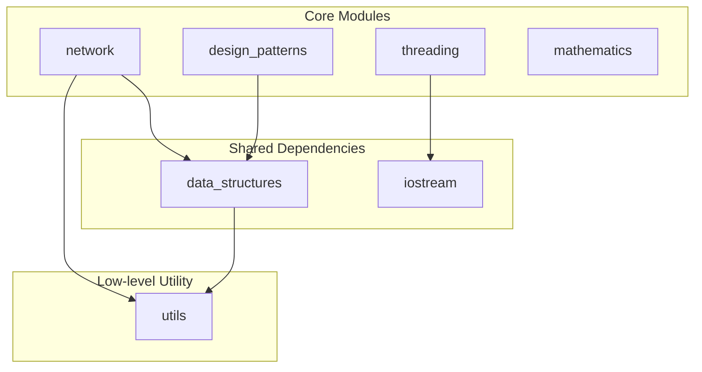
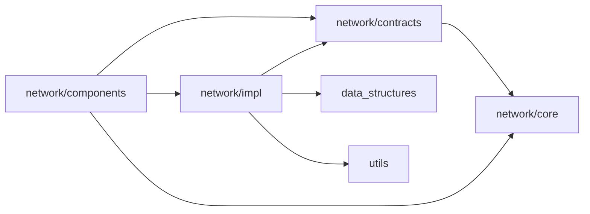

# libftpp

A modern C++ library built through [42 School](https://42.fr) subject exercises as a deliberate practice ground for **SOLID principles**, **decoupling strategies**, and **complex architectural design**.

> This project documents those decisions, not just the code.

---

## What is this?

`libftpp` is a collection of modular C++ components spanning networking, concurrency, data structures, design patterns, and mathematics. Each module is designed to be independently usable and composable, with clear interface boundaries.

The library serves two purposes simultaneously: as a **reusable foundation** for 42 project implementations, and as a **learning artifact** capturing the evolution of architectural thinking from "make it work" toward "make it right".

## Module-level Dependency Maps



### Modules

---

#### `network/` — Network Application Backbone

The goal of this module is to provide a solid architectural foundation that allows network service applications (IRC servers, HTTP servers, game backends) to be designed with good decoupling from day one — without needing to reinvent transport, framing, or event-dispatch each time.

The module is structured in four layers with a hexagonal-style separation of concerns:

- **`core/`** — Pure domain objects with no dependencies. `Message` is a typed byte container; `Endpoint` captures address identity. These have no knowledge of sockets or I/O.
- **`contracts/`** — Pure abstract interfaces (ports) that define *what* the system does: `IReactor` for I/O multiplexing, `IStreamTransport` for byte-stream I/O, `IMessageCodec` for protocol framing, `IAcceptor` for connection acceptance, `ByteQueue` for buffered byte flow. Application code depends only on these — never on concrete implementations.
- **`components/`** — Orchestrators that wire contracts together: `Server` and `Client` manage lifecycle, `Connection` wraps a transport with a codec to give typed message exchange, `Dispatcher` routes messages to handlers, `MessageBuilder` assembles outbound frames, `PeerHandle` provides a stable identity for connected peers.
- **`impl/`** — Concrete adapters: `EpollReactor` for Linux I/O multiplexing, `TcpTransport`/`TcpAcceptor` for TCP, `LengthPrefixedCodec` for simple framing, `ByteQueueAdapter` bridging the buffer contract to the TLV-backed data layer.

The intended dependency direction is `impl → contracts ← components`, with `core` as the stable domain center. In practice, some components currently depend on concrete adapters (for example buffer adapters), but the architecture still keeps protocol contracts explicit and swappable. Replacing `EpollReactor` or `LengthPrefixedCodec` is largely localized to wiring and adapter boundaries.



- **Dependencies are intended to flow inward** — toward stable abstractions; current implementation still contains a few pragmatic adapter-level couplings.
- **Contracts are pure interfaces** — no wrapper classes, no default implementations leaking into ports.
- **Domain objects carry no behavior** — `Message`, `Endpoint` have no socket awareness.

---

#### `threading/` — Concurrency Primitives

Provides the building blocks for safe concurrent execution: `WorkerPool` manages a fixed pool of threads with a task queue, `Thread` wraps `std::thread` with lifecycle management, and `ThreadSafeQueue` is a blocking MPMC queue used internally for task dispatch. The design avoids raw mutex/condition-variable patterns leaking into application code by encoding them once here.

---

#### `data_structures/` — Serialization-Aware Containers

More than basic containers — this module is built around **TLV (Type-Length-Value)** encoding as a first-class primitive:

- `DataBuffer` is a contiguous byte buffer used as the in-memory representation for serialized data.
- `Pool<T>` is an object pool that manages reusable slots and can be resized with safety checks.
- `tlv.hpp` defines the core TLV frame structure (type tag + length + value payload).
- `tlv_type_traits.hpp` uses template specialization to map C++ types to TLV type tags at compile time.
- `tlv_adapters.hpp` and `tlv_io.hpp` provide the serialization/deserialization interface — encode a struct into a `DataBuffer`, decode it back — used by the network layer, the memento pattern, and anywhere persistent or transmittable state is needed.

This makes TLV a cross-cutting serialization mechanism shared across the library rather than reimplemented per module.

---

#### `design_patterns/` — Behavioral Pattern Library

Concrete, reusable implementations of common GoF patterns, each designed to be composable with the rest of the library:

- **`Singleton<T>`** — thread-safe explicit-lifecycle singleton (`instantiate / instance / destroy`) for controlled global access.
- **`Observer<Event>`** — Type-safe observer with subscription and broadcast.
- **`StateMachine<State>`** — transition-table-driven FSM with guarded state registration, transitions, and per-state actions.
- **`Memento`** — state snapshot and restore. `History` stores a sequence of snapshots; `SnapIO` supports persistence via TLV adapters from `data_structures/`.

The Memento/TLV integration is a deliberate design choice: rather than giving Memento its own ad-hoc serialization, it reuses the library's canonical encoding layer.

---

#### `iostream/` — Thread-Safe I/O

`ThreadSafeIOStream` serializes both output and input access via shared mutexes, and provides per-thread buffered logging/prefix behavior through a thread-local stream instance.

---

#### `mathematics/` — Spatial & Generative Math

Utilities for spatial computation and procedural generation:

- `IVector2<T>` / `IVector3<T>` — templated 2D/3D vectors with arithmetic operators (usable with integer or floating-point scalar types).
- `PerlinNoise2D` — Coherent noise generation for procedural maps.
- `Random2DCoordinateGenerator` — Seeded random coordinate sampling over a 2D space.

These support game-world and simulation use cases in 42 projects like terrain generation or procedural map layout.

---

#### `utils/` — Low-Level Utilities

- `endian.hpp` — Byte-order conversion utilities (host ↔ network byte order). Used internally by the TLV and TCP layers to ensure portable wire formats.

---

## Learning Notes

Notes are organized under `docs/`:

```
docs/
├── cpp/            # Modern C++ syntax & idiom notes
└── architecture/   # Design thinking & decision records

```

This README is the portal. The depth is in `docs/`.


---

## Build

```bash
# Build the full library
make

# Build a specific module
make <module>          # e.g. make network, make threading

# Run all tests (parallel by default)
make tests
make tests TEST_JOBS=8

# Run tests for a specific module
make test_network
make test_threading
make test_data_structures

# Build and run examples
make examples
make perlin_noise_visualization

# Clean
make clean             # clean build artifacts
make fclean            # remove build/ entirely
make re                # fclean + all
```

See make help for the full list of targets.
Requires: CMake ≥ 3.20, GCC/Clang with C++20, Linux (epoll for EpollReactor).

---

## Module Status

| Module | Status |
|---|---|
| `data_structures` | ✅ stable |
| `design_patterns` | ✅ stable |
| `iostream` | ✅ stable |
| `mathematics` | ✅ stable |
| `threading` | ✅ stable |
| `utils` | ✅ stable |
| `network/core` | ✅ stable |
| `network/contracts` | ✅ stable |
| `network/impl/tcp` | ✅ stable |
| `network/impl/reactor` | ✅ stable |
| `network/components` | ✅ stable |
| `network/impl/codec` | ✅ stable |

`✅ stable` · `🚧 in progress` · `📋 planned`
